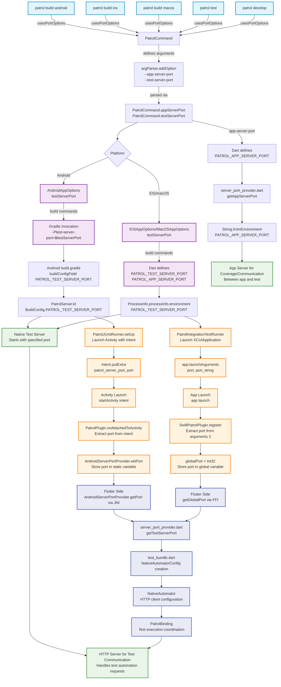

# Patrol CLI Port Arguments Flow Analysis

This document analyzes the flow of `--app-server-port` and `--test-server-port` arguments through the patrol_cli system.

## Commands that accept port arguments

The following patrol_cli commands accept both `--app-server-port` and `--test-server-port`:

- `patrol build android`
- `patrol build ios` 
- `patrol build macos`
- `patrol test`
- `patrol develop`

## Flow Diagram



## Detailed Flow Description

### 1. Argument Definition
All commands that support port options call `usesPortOptions()` which adds:
- `--app-server-port` (default: 0) - Port for server in the app under test
- `--test-server-port` (default: 0) - Port for server in test instrumentation app

### 2. Argument Parsing
Arguments are parsed through:
```dart
int get appServerPort => intArg('app-server-port')
int get testServerPort => intArg('test-server-port')
```

### 3. Platform-Specific Processing

#### Android
1. **test-server-port**: 
   - Passed to `AndroidAppOptions.testServerPort`
   - Added to Gradle build as `-Ptest-server-port=$testServerPort`
   - Processed in `build.gradle` as `buildConfigField("String", "PATROL_TEST_SERVER_PORT", ...)`
   - Used in `PatrolServer.kt` via `BuildConfig.PATROL_TEST_SERVER_PORT`

2. **app-server-port**:
   - Passed as Dart define `PATROL_APP_SERVER_PORT`
   - Retrieved in app via `getAppServerPort()` from `server_port_provider.dart`

#### iOS/macOS
1. **test-server-port**:
   - Passed to `IOSAppOptions`/`MacOSAppOptions.testServerPort`
   - Set as environment variable `PATROL_TEST_SERVER_PORT`
   - Used in `PatrolServer.swift` via `ProcessInfo.processInfo.environment`

2. **app-server-port**:
   - Same as Android - passed as Dart define `PATROL_APP_SERVER_PORT`

### 4. Activity/App Launch and Port Transmission

#### Android Launch Flow
1. **Test Launch**: `PatrolJUnitRunner.setUp()` creates and launches the target activity
2. **Intent Preparation**: Port is added to launch intent as extra:
   ```java
   intent.putExtra("patrol_server_port", port);
   instrumentation.getTargetContext().startActivity(intent);
   ```
3. **Activity Attachment**: `PatrolPlugin.onAttachedToActivity()` extracts port from intent:
   ```kotlin
   val serverPort = intent.getIntExtra("patrol_server_port", 0)
   AndroidServerPortProvider.setPort(serverPort)
   ```

#### iOS/macOS Launch Flow
1. **App Launch**: Test runner creates and launches XCUIApplication
2. **Launch Arguments**: Port is passed as launch argument:
   ```objective-c
   app.launchArguments = @[ @"port", [@(server.port) stringValue] ];
   [app launch];
   ```
3. **Plugin Registration**: `SwiftPatrolPlugin.register()` extracts port from process arguments:
   ```swift
   globalPort = Int32(Int(ProcessInfo.processInfo.arguments[2])!)
   ```

### 5. Flutter Side Port Retrieval

#### Android (JNI)
1. **JNI Bindings**: Auto-generated bindings in `android_server_port_provider_bindings.dart`
2. **Port Retrieval**: 
   ```dart
   int getTestServerPort() {
     if (Platform.isAndroid) {
       return AndroidServerPortProvider.getPort(); // JNI call
     }
   }
   ```
3. **Native Implementation**: Simple Java class with static methods:
   ```java
   public class AndroidServerPortProvider {
       private static int serverPort;
       public static void setPort(int newValue) { serverPort = newValue; }
       public static int getPort() { return serverPort; }
   }
   ```

#### iOS/macOS (FFI)
1. **C Export**: Global port exposed via C function in `GlobalPort.swift`:
   ```swift
   var globalPort: Int32 = 0
   
   @_cdecl("getGlobalPort")
   public func getGlobalPort() -> Int32 { return globalPort }
   ```
2. **FFI Lookup**: Flutter code uses FFI to call native function:
   ```dart
   int _getIosServerPort() {
     final nativeLibrary = DynamicLibrary.process();
     final int Function() getGlobalPort = nativeLibrary
         .lookup<NativeFunction<Int32 Function()>>('getGlobalPort')
         .asFunction();
     return getGlobalPort();
   }
   ```

### 6. Flutter Test Framework Integration

#### Test Bundle Generation
1. **Test Server Port Usage**: `test_bundler.dart` generates entrypoint that retrieves port:
   ```dart
   final config = NativeAutomatorConfig(port: getTestServerPort().toString());
   final nativeAutomator = NativeAutomator(config: config);
   ```

2. **HTTP Client Configuration**: Port is used to configure HTTP client for native communication:
   ```dart
   _client = NativeAutomatorClient(
     http.Client(),
     Uri.http('${_config.host}:${_config.port}'),
     timeout: _config.connectionTimeout,
   );
   ```

3. **Test Coordination**: `PatrolBinding` uses the automator to coordinate test execution between Dart and native sides

### 7. Runtime Usage

#### Test Server Port
- Used to start HTTP server in test instrumentation app
- Handles communication from native test runner to Flutter test
- If port is 0, a random free port is automatically selected

#### App Server Port  
- Used for server running in the app under test
- Enables communication for features like code coverage collection
- Retrieved via `String.fromEnvironment('PATROL_APP_SERVER_PORT')`

### 8. Default Behavior
- Both ports default to 0
- When 0 is specified, the system automatically finds and uses free ports
- This prevents port conflicts during parallel test execution

## Key Files Involved

```text
packages/patrol_cli/lib/src/runner/patrol_command.dart         # Argument definition
packages/patrol_cli/lib/src/crossplatform/app_options.dart     # Platform options
packages/patrol_cli/lib/src/commands/                          # Individual commands
packages/patrol/android/build.gradle                           # Android build config
packages/patrol/android/src/main/kotlin/.../PatrolServer.kt    # Android server
packages/patrol/android/src/main/kotlin/.../PatrolJUnitRunner.java # Android test launcher
packages/patrol/android/src/main/kotlin/.../PatrolPlugin.kt    # Android port extraction
packages/patrol/android/src/main/kotlin/.../AndroidServerPortProvider.java # Android port storage
packages/patrol/darwin/Classes/AutomatorServer/PatrolServer.swift # iOS/macOS server
packages/patrol/darwin/Classes/PatrolIntegrationTest*Runner.h   # iOS/macOS test launcher
packages/patrol/darwin/Classes/SwiftPatrolPlugin.swift         # iOS/macOS port extraction
packages/patrol/darwin/Classes/AutomatorServer/GlobalPort.swift # iOS/macOS port storage
packages/patrol/lib/src/server_port_provider.dart              # Flutter port access
packages/patrol/lib/src/server_port/android_server_port_provider_bindings.dart # JNI bindings
packages/patrol_cli/lib/src/test_bundler.dart                  # Test entrypoint generation
```

This architecture allows patrol_cli to coordinate port usage across different platforms while maintaining flexibility for custom configurations and avoiding port conflicts. The key innovation is the seamless transmission of port information from the CLI through native test runners to the Flutter application layer, enabling coordinated communication between all components of the testing system.
